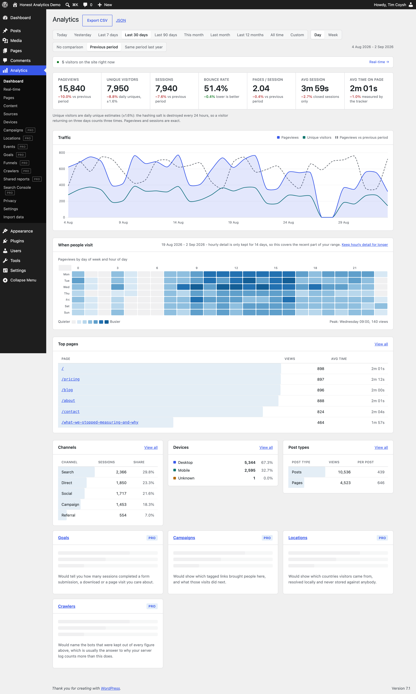

[](https://wordpress.org/plugins/honest-analytics/)
[](https://opensource.org/license/GPL-2.0)
[](https://wordpress.org/plugins/honest-analytics/)
[](https://github.com/Coysh-Digital/wp-honest-analytics/actions)

# Honest Analytics

Privacy-first, cookieless analytics for WordPress. No third-party service, no
addresses, no per-visitor rows.

A WordPress port of [Craft Analytics][craft], built by
[Coysh Digital](https://coysh.digital).

[craft]: https://github.com/coysh-digital/craft-analytics

---

## What it does

Counts your traffic - pages, sources, devices, content - and shows it in the
WordPress admin, without sending anything anywhere and without storing anything
that could identify a visitor later.

It works behind full-page caches. It works with content blockers. It works
without JavaScript, in a reduced form. It works without paying for anything.

Here is the dashboard - traffic, channels, devices, and when people visit, all
in the WordPress admin:



## What it does not do

- Call a third party while it counts. Not for analytics, not for fonts, not
  for map tiles, not for telemetry. The only outbound call is one you start:
  importing your history from Google Analytics. It can also answer a reporting
  tool you connect to it, which stays off until you paste in a connection code.
- Store an address. Not in a table, not in a log, not in a cache key, not in
  the write spool.
- Store a full referrer URL or a full user-agent string. Both are reduced in
  the request that saw them - to an origin, and to four device families - so
  neither reaches the spool either.
- Store a raw pageview. A hit waits in the write spool for a few minutes and is
  folded into counters; nothing keeps one afterwards.
- Set a cookie. This edition has no feature that sets one, consented or
  otherwise.
- Count a visitor who sent `Sec-GPC: 1`.

## How it counts people without identifying them

A visitor is a 16-character hash of a random daily salt, the address, the
user agent and the site. The salt is **overwritten in place** every 24 hours,
so yesterday's hashes cannot be recomputed by anyone - including someone
holding the database and the address.

Uniqueness is estimated from a fixed-size HyperLogLog sketch on the rollup row,
accurate to about ±1.6%. The sketch cannot be asked whether it contains a
particular person; it holds no identifiers.

This is why "unique visitors" means **daily** uniques, and why the interface
says so everywhere the number appears.

## How it survives a page cache

The server counts requests it sees. A 1.8 KB first-party tracker confirms the
rest. A nonce reconciles the two - consumed once **per visitor**, not once per
nonce, so one piece of cached HTML served to a thousand people counts a
thousand times, and one visitor reloading counts once.

No cache exclusions, no hole punching, no cache-plugin add-on.

## Storage

Growth is **dimensions × time**, not **pageviews × time**. A site with a
hundred thousand views a day and one with a hundred use roughly the same disk,
because both write one row per hour per dimension. Around 110,000 events fit in
about 15 MB.

## Screens

Dashboard · Real-time · Pages · Page detail · Content · Sources · Devices ·
Privacy · Settings · Import data · Reporting API.

Every one of them is in this edition, with no row caps, no retention caps, no
date-range caps and nothing that expires. A privacy-first analytics plugin that
will not tell you your top pages without payment is not a privacy-first
analytics plugin.

Campaigns, locations, events, goals, funnels, crawler reporting, shareable
client report links, Search Console queries, scheduled email summaries and the
form and commerce integrations are in the paid edition. None of that code is in
this repository: it is removed when this edition is packaged, so there is no key
to enter and nothing here to unlock.

## Install

WordPress 6.4+, PHP 8.1+, MySQL 5.7+ or MariaDB 10.4+.

The free edition is distributed on wordpress.org: **Plugins → Add New**, search
for **Honest Analytics**, **Install Now**, **Activate**. The paid edition is a
direct download, installed through **Plugins → Add New → Upload Plugin**.

Either way, activate and visit **Analytics**. Then set up
[scheduling](https://honest-analytics.com/docs/), because a cached site needs a
real cron schedule for the aggregation to keep up.

Full instructions are in the [documentation](https://honest-analytics.com/docs/).

## Documentation

Full documentation lives at
**[honest-analytics.com/docs](https://honest-analytics.com/docs/)** -
installation and first run, scheduling and health checks, how cached pages are
counted, exactly what is stored and how to verify it, importing your history,
retention and growth, uninstalling, and the architecture decisions behind it
all.

## WP-CLI

Optional, every one of them. Nothing the plugin needs doing requires a terminal:
maintenance runs from buttons on Settings, and counting works on hosts with no
cron at all. WP-CLI is there for people who prefer it and for scripting.

```bash
wp honest-analytics info
wp honest-analytics drain [--retry] [--watch] [--network] [--quiet]
wp honest-analytics gc [--dry-run] [--quiet]
wp honest-analytics salt rotate
wp honest-analytics salt status
wp honest-analytics privacy posture
wp honest-analytics privacy export --user-id=<id> [--format=json]
wp honest-analytics privacy erase --visitor-id=<hash>
wp honest-analytics report [<kind>] [--range=30d] [--limit=20] [--format=csv]
wp honest-analytics seed --days=400 --per-day=520 --content --force
```

## Checking the claims

```bash
# The write spool, before aggregation. No address, no user agent, and a
# referrer reduced to its origin.
cat wp-content/uploads/honest-analytics/spool/*.ndjson | head

# Rotate the salt, and watch every identity cease to exist.
wp honest-analytics salt rotate
```

The claim is also tested rather than asserted. `NoIpPersistedTest` drives a
request with a known address and then searches every table, the key-value store,
the spool and the debug log for it, failing the build if it finds it. The suite
is not part of a distribution, so it lives in the development repository rather
than here.

## Licence

GPL-2.0-or-later. See [LICENSE.md](LICENSE.md) and
[licenses/THIRD-PARTY-LICENSES.md](licenses/THIRD-PARTY-LICENSES.md).
